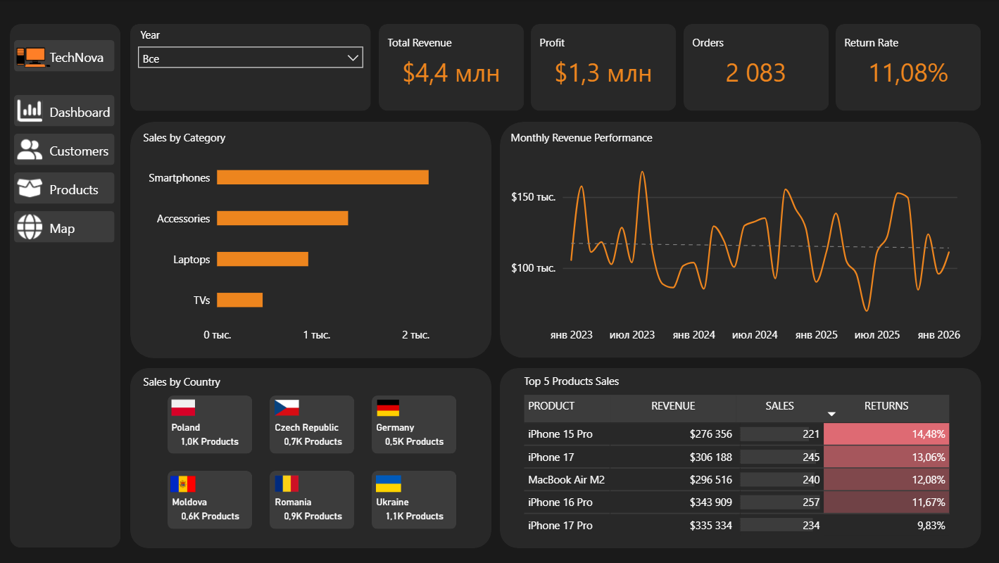

# TechNova E-commerce Sales Analysis

This project analyzes the sales performance of **TechNova**, a fictional e-commerce company.  
The goal of the project is to explore sales data, identify key business insights, and build an interactive **Power BI dashboard** to support data-driven decision making.

The project demonstrates practical **data analytics workflow**, including SQL data modeling, metric calculation, and business intelligence visualization.

---

# Business Questions

This analysis answers the following questions:

- What is the total revenue trend over time?
- Which products generate the highest revenue?
- What is the average order value?
- Which categories have the highest sales volume?

---

# Project Overview

The analysis focuses on understanding:

- Revenue performance
- Customer purchasing behavior
- Product performance
- Return rates
- Sales trends over time

An interactive **Power BI dashboard** was built to explore these insights visually.

---

# Tools & Technologies

- SQL
- MySQL
- Power BI
- DAX
- Data Modeling (Star Schema)

---

# Repository Structure

```
technova-ecommerce-sales-analysis
│
├── database
│   ├── data_model.png
│   └── technova_dump.sql
│
├── dataset
│   ├── dim_categories.csv
│   ├── dim_customers.csv
│   ├── dim_products.csv
│   ├── dim_subcategories.csv
│   ├── fact_order_items.csv
│   ├── fact_orders.csv
│   └── fact_returns.csv
│
├── sql
│   ├── create_tables
│   │   └── create_tables.sql
│   └── analysis_queries
│       ├── 01_Total_Revenue.sql
│       ├── 02_Total_Order_Amount.sql
│       ├── 03_Return_Rate.sql
│       ├── 04_Top_10_Products.sql
│       ├── 05_Customer_Order_Count.sql
│       ├── 06_Average_Product_Price_By_Category.sql
│       ├── 07_Subcategory_Revenue_Above_100k_2025.sql
│       ├── 08_Average_Order_Value_marketing_channel.sql
│       ├── 09_Refund_Amount.sql
│       ├── 10_Monthly_Running_Total.sql
│       └── 11_Top_Customers_By_Revenue.sql
│
├── powerbi
│   └── tech_nova.pbix
│
├── images
│   ├── dashboard_overview.png
│   ├── customer_analysis.png
│   ├── map_analysis.png
│   └── product_analysis.png
│
├── LICENSE
└── README.md
```

---

# Data Model

The dataset follows a **star schema** structure.

### Fact Tables
- `fact_orders`
- `fact_order_items`
- `fact_returns`

### Dimension Tables
- `dim_customers`
- `dim_products`
- `dim_categories`
- `dim_subcategories`
- `dim_calendar`

This structure allows efficient analytical queries and dashboard performance.

---

# SQL Analysis

SQL was used to:

- calculate revenue and profit metrics
- analyze sales by product and category
- calculate order metrics
- identify top performing products

Example query:

```sql
SELECT SUM(total_order_amount) AS total_revenue
FROM (
    SELECT
        fo.order_id,
        SUM(dp.price * fi.quantity) * (1 - fo.discount_amount)
        + fo.shipping_amount AS total_order_amount
    FROM fact_orders fo
    JOIN fact_order_items fi ON fo.order_id = fi.order_id
    JOIN dim_products dp ON fi.product_id = dp.product_id
    WHERE fo.order_status = 'Completed'
    GROUP BY fo.order_id, fo.discount_amount, fo.shipping_amount
) t;
```

---

# Key Business Metrics

The dashboard includes several important e-commerce KPIs:

- Total Revenue
- Gross Revenue
- Discount Amount
- Total Cost
- Profit
- Number of Orders
- Unique Customers
- Revenue per Customer
- Return Quantity
- Return Rate

---

# Dashboard Pages

### Overview

Main business KPIs and overall performance.

Insights include:

- Total revenue
- Profit
- Number of Orders
- Revenue trends by month
- Sales by country
- Top selling products

### Product Analysis

Product performance insights:

- Revenue by product
- Product return rates
- Quantity sold by product
- Profit by product
- Adjustment profit by product

### Customer Analysis

Customer behavior insights:

- Customer segmentation
- Unique customers
- Revenue per customer
- Customer purchase distribution
- Customer geographic distribution

---

# Example Dashboard

Overview page:



---


